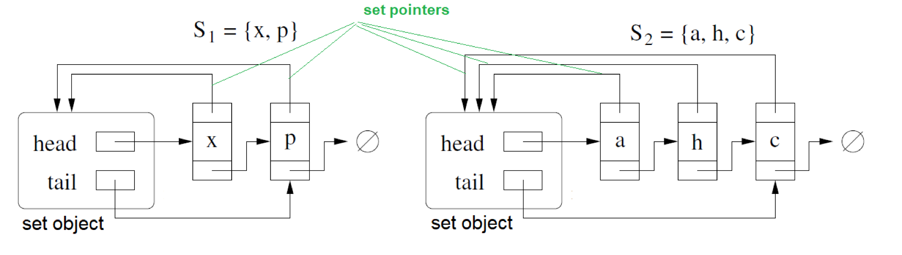
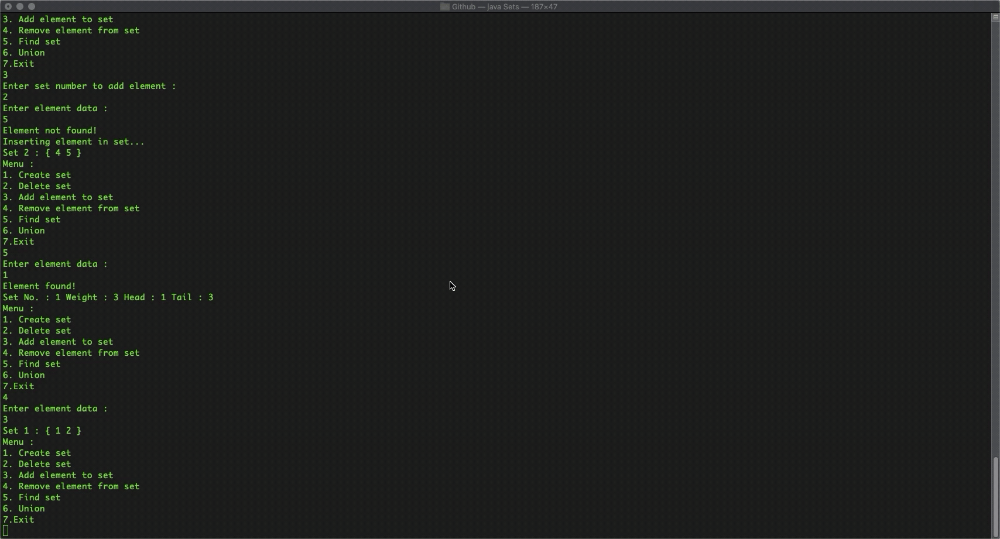

# Disjoint-Sets
Implementation of Disjoint Sets using Linked List in Java

## What are Disjoint Sets?
If there are no elements common between two sets then the two sets are said to be disjoint. A collection of more than two sets is called disjoint if any two distinct sets of the collection is disjoint. Two sets A and B are said to be disjoint if
> A ⋂ B = ϕ

## Sample Representation
Consider the following representation of two sets 

 
*Image source : http://www.cs.umanitoba.ca/~kamalis/winter19/comp3170/disjoint-sets-handouts.pdf*

Here the weights of the sets would be 2 and 3 respectively and are stored in the corresponding representative element/set object.

## Design of Classes

1. Representative class:
* Member variables:
  * head
  * tail
* Member functions:
  * Representative()

2. Node class:
* Member variables:
  * data
  * head
  * next
* Member functions:
  * Node(int data)
	
3. Set class:
* Member variables:
  * sets
* Member functions:
  * makeset(int setNo, int value)
  * deleteElement(int setNo, int value)
  * printSets(int number, Representative rep)
  * findset(int value)
  * union(Representative r1, Representative r2)
  * main(String[] args)

## Implementation of classes 

1. Representative class:
* The representative of a set is also called the set object for the set.
* Member variables:
  * head: stores the address of the first element in the set
  * tail: stores the address of the last element in the set
* Member functions:
  * Representative(): initialises the representative object with the null 

2. Node class:
* Member variables:
  * head: stores the address of the first element in the set (Each node stores a set pointer to the set object) 
  * data: stores the integer value
  * next:  stores the address of the next element in the set
* Member functions:
  * Node(int data): initialises the node object with the data

3. Set class:
* Member variables:
    * sets: an array list that stores the address of the representative elements of each set
* Member functions:
  * makeset(int setNo, int value)
    * Used to insert a value into the designated set
    * Case1: The set is present and the element is inserted
    * Case2: The set is present and the element cannot be  inserted because of presence of duplicates
  * deleteElement(int setNo, int value)
    * Used to delete the element by value
    * Case 1: Deleting the only element of a set
    * Case 2: Deleting the tail element of a set
    * Case 3: Deleting the head element of a set
    * Case 4: Deleting any element other than head or tail
    * Case 5: Deleting an element that is not present
  * printSets(int number, Representative rep)
    * Used to print the set represented by the given representative node 
  * findset(int value)
    * Used to find representative of the set where the element is present
    * Case 1: Searching an element that is present
    * Case 2: Searching an element that is not present
  * union(Representative r1, Representative r2)
    * Used for the union of the two sets represented by the representative nodes based on their weights
    * Case 1: The elements are present in the same set
    * Case 2: The elements are not present in the same set
    * Case 3: The elements are not present in the set
  * main (String[] args)
    * Provides a menu driven approach for performing various operations on the disjoint set
    * The various operations that can be performed are
      * Creating a set
      * Deleting the set
      * Adding elements to the set
      * Deleting elements from the set
      * Finding the representative of a given element
      * Union of two sets
      
# Output

## Create set
 

## Add element to set
 

## Find set
 

## Remove element from set
 

## Union
 

## Delete set and Exit
 

